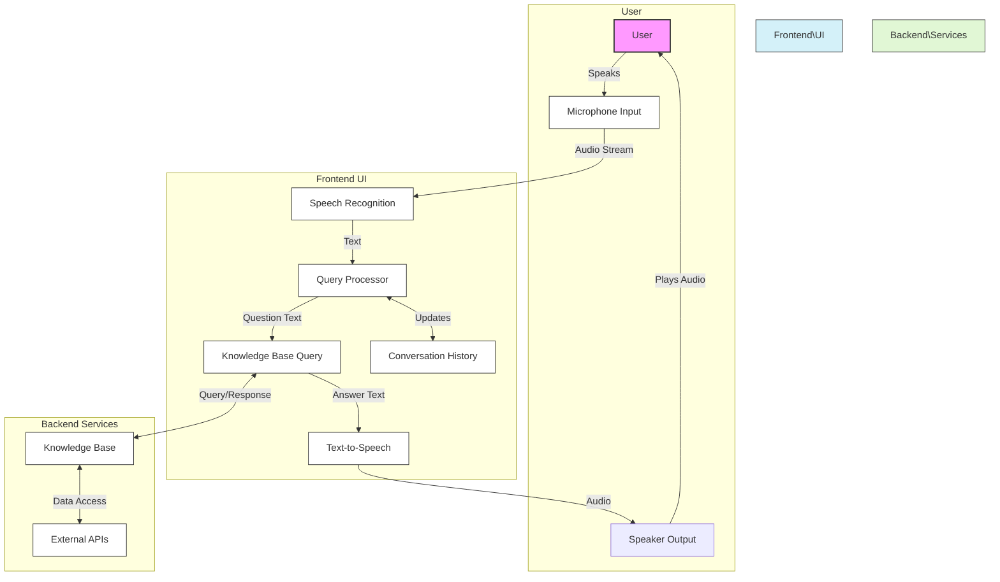

# Rashmika Voice AI Assistant

A modern, web-based voice assistant that processes natural language questions and provides spoken responses.

## 🌟 Features

- **Voice-to-Text**: Captures user speech and converts it to text queries
- **Natural Language Processing**: Understands user intent from spoken questions
- **Knowledge Base Integration**: Retrieves answers from a structured knowledge system
- **Text-to-Speech**: Delivers responses in a natural-sounding voice
- **Conversation History**: Maintains context across multiple interactions

## 🏗️ Architecture

The Rashmika Voice AI Assistant follows this architectural pattern:



## 🚀 Getting Started

### Prerequisites

- Node.js (v14 or higher)
- Modern web browser with speech recognition support (Chrome recommended)

### Installation

1. Clone the repository:
   ```bash
   git clone https://github.com/yourusername/rashmika-voice-assistant.git
   cd rashmika-voice-assistant
   ```

2. Install dependencies:
   ```bash
   npm install
   ```

3. Start the development server:
   ```bash
   npm start
   ```

4. Open your browser and navigate to `http://localhost:3000`

## 💻 Usage

1. Click the microphone button to start listening
2. Ask a question using natural language
3. Rashmika will process your question and respond both in text and speech
4. View your conversation history at the bottom of the interface

### Example Questions

- "What is your name?"
- "What time is it?"
- "Tell me a joke"
- "What can you do?"

## 🔧 Customization

### Adding to the Knowledge Base

Extend the `knowledgeBase` object in `src/components/VoiceAIAgent.jsx`:

```javascript
const knowledgeBase = {
  "your query pattern": "Your response text",
  // Add more entries here
};
```

### Connecting to External APIs

To integrate with external services like weather or news APIs:

1. Create a new API client in `src/services/`
2. Import the client in the VoiceAIAgent component
3. Update the query processor to handle specific question patterns
4. Call the API client and format the response

## 🛠️ Tech Stack

- React.js - Frontend framework
- Web Speech API - Speech recognition and synthesis
- JavaScript - Core programming language
- HTML/CSS - Interface styling

## 📝 Future Enhancements

- [ ] Implement wake word detection ("Hey Rashmika")
- [ ] Add authentication for personalized responses
- [ ] Integrate with smart home devices
- [ ] Support multiple languages
- [ ] Add voice customization options

## 📄 License

This project is licensed under the MIT License - see the [LICENSE](LICENSE) file for details.

## 👥 Contributing

Contributions are welcome! Please feel free to submit a Pull Request.

1. Fork the repository
2. Create your feature branch (`git checkout -b feature/amazing-feature`)
3. Commit your changes (`git commit -m 'Add some amazing feature'`)
4. Push to the branch (`git push origin feature/amazing-feature`)
5. Open a Pull Request

## 🙏 Acknowledgements

- Web Speech API documentation
- React.js community
- Contributors and testers
